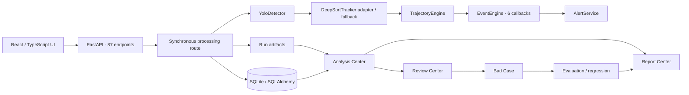

# SmartTraffic 项目介绍

> 面试准备版；事实修订基线：`main@81a973013a1f3f8be98bd2aa647d7bf497d0bec3`（HEAD 无 tag，2026-07-18 本地核对）。
>
> 事实优先级：当前代码、配置、迁移与测试 > 当前 README / 设计文档 > Git 标签与历史说明 > 本机忽略产物。本文不会把本机结果、历史计划、默认 dry-run 或占位接口表述为已上线能力。

## 1. 一句话定位

SmartTraffic 是一个面向本地视频的交通事件分析与复核平台：它把视频上传、YOLO 检测、目标跟踪、轨迹特征、六类规则事件、告警、人工复核、坏例、评测和报告串成一条可追溯的本地闭环。

它更准确的定位是“可演示、可测试的本地验证平台”，不是已经接入生产路网的实时交通执法系统。

## 2. 证据状态图例

| 状态 | 含义 | 面试表达 |
|---|---|---|
| 当前实现 | 当前 HEAD 中存在完整入口、核心逻辑和输出 | “当前代码已实现……” |
| 测试覆盖 | 有测试证明指定行为，但不等同于生产验证 | “自动化测试覆盖了……” |
| 契约/预留 | 路由、字段、文档或适配器存在，真实能力不完整 | “当前保留契约，尚未完成……” |
| 本机快照 | Git 忽略目录中存在资产或结果，不能代表仓库可复现基准 | “本机曾生成，但不作为 HEAD 基准……” |
| 未来能力 | 当前 HEAD 不存在 | “如果生产化，我会……” |

## 3. 审计基线与仓库事实

| 项目 | 结论 |
|---|---|
| 分支 / HEAD | `main` / `81a9730`（本轮修改前） |
| HEAD tag | 无 |
| 已跟踪文件 | 377 个，约 78,146 行（修改前 HEAD） |
| 后端 | FastAPI、SQLAlchemy、Alembic、OpenCV、Ultralytics、Pytest |
| 前端 | React 18、TypeScript、Vite；没有 React Router 和图表库 |
| API | 17 个路由模块、87 个 HTTP 端点 |
| ORM | 21 个模型类、4 个迁移版本 |
| 页面 | 10 个主页面 |
| 自动化验证 | 后端 487/487；前端 90/90；Vite build、Compose config、danger check 通过 |
| CI | 当前仓库没有已跟踪的 CI workflow |
| 权重/视频/结果 | 只在 Git 忽略的本机目录中存在；仓库仅跟踪 `.gitkeep` |
| 未跟踪用户资料 | `SmartTraffic_Report_Materials/` 与根目录最终手册；本次不修改、不提交 |

审计时的本机 ignored 快照包括：1 个 `yolov8n.pt`（6,549,796 bytes）、5 个本地 MP4（单个约 3.6–183.8 MB）、26 个 run 目录、约 65.1 MB 的 results SQLite，以及 evaluation JSONL。它们说明这台机器曾运行过流程，但不在 Git、没有随 HEAD 交付，不能作为可独立复现的正式 benchmark；本文不引用其中分数作为项目指标。

仓库内可复现的样本事实只有 `evals/expected/` 的 3 个 JSON 契约：2 条 toy flow count、覆盖六类事件的 toy expected events、以及指定 demo run 的 14 条危险区事件；`local_models/`、`local_videos/`、`evals/datasets/`、`evals/results/` 和 `results/` 在 HEAD 中只有占位文件。

## 4. 它解决什么问题

交通视频算法项目常见断点不是“能不能检测到车”，而是：一次分析能否复现、规则为何命中、告警如何复核、误报如何沉淀、指标如何解释、报告能否关联原始证据。SmartTraffic 将这些断点放在同一条 run 级链路中：

1. 保存输入视频与处理配置；
2. 生成检测、跟踪和轨迹中间产物；
3. 用可配置规则生成事件与证据；
4. 从事件生成告警并支持状态流转；
5. 由 Review Center 记录确认、误报、忽略、评论和漏报；
6. 将问题样本沉淀为 Bad Case；
7. 用 Evaluation Center 做事件、流量、检测、跟踪、轨迹或回归评测；
8. 用 Report Center 汇总并导出。

## 5. 目标用户与真实边界

合理的目标角色是算法工程师、交通分析人员、演示验收人员和复核人员；仓库没有真实用户访谈、线上租户或使用量证据，因此不能声称已有客户、日活或业务增益。

若面试官追问个人背景、团队规模、用户数量、数据规模、耗时优化或线上收益，统一回答：`【本人待补充】`，并区分个人经历与仓库事实。

## 6. 30 秒介绍

SmartTraffic 是一个面向交通视频的事件分析与质量闭环平台。它以 Analysis Run 为核心，把目标检测、多目标跟踪、轨迹分析、六类交通事件、证据生成、告警复核、坏例回归和报告导出串成完整链路。工程上通过 config snapshot、manifest 和 Event / Evidence / RuleExecution 让每次分析可追踪、事件判断可解释、错误能进入评测回归。当前定位是本地验证平台，尚未扩展为多摄像头实时生产系统。

## 7. 1 分钟介绍

SmartTraffic 解决的不是“视频里能不能画出检测框”这一个问题，而是如何把一次交通视频分析变成可追踪、可解释、可复核的工程闭环。用户输入本地视频和处理参数后，系统创建 Analysis Run，依次执行 Detection → Track → Trajectory；Event Engine 再结合 Zone 与 EventRule 生成六类 Event，并保存 Evidence 与 RuleExecution，随后生成告警和视觉证据。

每个 run 都保留 config snapshot、manifest 和结构化 artifact。Analysis Center 聚合展示结果；Review 把人工确认、误报和漏报带入 Bad Case；Bad Case 再进入 Evaluation；Report 汇总 run、事件、告警、评测与文件导出。这样，错误不止停留在页面上，而能回到可复现的质量回归链路。当前系统定位为本地验证平台：处理仍在同步 HTTP 请求中完成，真实模型、实时流和生产基础设施尚未形成可交付的默认能力。

## 8. 3 分钟介绍

SmartTraffic 的目标是把交通视频算法从一次性输出提升为可追踪的分析与质量闭环。前端提供 Video、Analysis、Zone/Rule、Alert、Review、Bad Case、Evaluation、Report 等页面；主链从 `POST /api/videos/{video_id}/process` 进入，在一个 Analysis Run 内依次执行检测、跟踪、轨迹、事件、告警和视觉证据生成，并把结果写入 SQLite 与 `results/traffic_analysis/{run_id}` 下的结构化 artifact。

第一个技术亮点是 run 级可追溯。config snapshot 记录处理参数，manifest 显式区分 available、empty、missing 与 error，CSV/JSONL/summary 让页面、导入工具和报告可以沿同一个 run 找回证据。第二个亮点是可解释事件。Event Engine 把逐轨规则与 aggregate 规则分开，六类 callback 输出 Event / Evidence / RuleExecution；逆行可以回到方向角差，违停可以回到低速驻留，流量可以回到越线方向，拥堵可以回到区域车辆数和平均像素速度。第三个亮点是质量闭环。Alert 进入人工 Review，误报和漏报沉淀为 Bad Case，再进入 Evaluation 和 Report，而不是让错误停留在一次页面展示中。

CV 层保留清晰的 provider 边界：`YoloDetector` 是 Ultralytics adapter，默认 dry-run 且仓库没有正式权重；`DeepSortTracker` 只有安装额外依赖时才走真实 DeepSORT，当前 requirements 未包含该依赖，默认可复现路径是确定性贪心 fallback，且没有 ByteTrack。轨迹计算只得到 `px/frame` 或 `px/s`，未做相机标定，不能表述为 km/h。拥堵当前按连续帧聚合，不是真实 elapsed-time sliding window；detection evaluation 是单 IoU=0.5 的 VOC-style AP，tracking evaluation 是轻量近似指标，不是 COCO mAP 或官方 TrackEval/HOTA。

工程上它仍是本地验证平台：视频任务在同步 HTTP 请求中执行；SQLite 与本地 artifact 不在一个原子事务；RTSP preview 明确不拉流、不推理；权限只是 permissive/header contract；Compose 也只是 backend/frontend 两服务的本地交付。生产化应按风险依次补齐固定模型与 tracker、durable worker、对象存储和一致性治理、真实数据集与标准评测、单路 RTSP 稳定性、可信身份、监控与恢复演练，而不是把这些目标态说成当前能力。

## 9. 输入—中间产物—输出

| 类型 | 内容 | 当前边界 |
|---|---|---|
| 输入 | 本地视频、处理模式、模型与 tracker 参数、Zone、EventRule、评测 expected data | 正式权重与真实评测数据未随仓库交付；RTSP 不是当前真实输入链路 |
| 中间产物 | Detection、Track、TrajectoryPoint、Zone History、RuleExecution、EventEvidence、config snapshot、manifest | dry-run 可产生合法空产物；manifest 会显式记录 empty/missing/error |
| 业务产物 | Event、Alert、Review、False Negative、Bad Case | Event 只有六类；人工身份来自不可信 header 契约 |
| 统计产物 | FlowCount、ZoneStatistic、EvaluationResult | 当前评测是轻量实现，不等于标准生产 benchmark |
| 文件产物 | CSV、JSONL、summary、keyframe、annotated video、PDF | 文件位于本地 artifact 目录，与 SQLite 非原子；PDF 与 Web 只保证核心 summary 一致 |
| 页面输出 | Analysis、Alert、Review、Bad Case、Evaluation、Report | 页面用于本地验证，不代表多租户实时生产系统 |

## 10. 功能全景与成熟度

| 能力 | 当前状态 | 关键边界 |
|---|---|---|
| 视频上传与元数据 | 当前实现、测试覆盖 | 整文件读入内存；同名文件覆盖风险；无 MIME/病毒扫描 |
| YOLO 检测 | 适配器已实现、dry-run 与真实路径有测试 | 默认 dry-run；权重不入库；无训练代码 |
| 目标跟踪 | fallback 当前实现，真实 DeepSORT 为可选路径 | 依赖未声明；无 ByteTrack；无正式 MOT benchmark |
| 轨迹引擎 | 当前实现、单元测试覆盖 | 像素坐标；无标定；内存状态 |
| 六类事件 | 当前实现、规则测试覆盖 | 规则法；阈值依赖场景；拥堵非真时间窗 |
| 告警 | 当前实现 | 由事件派生，不是独立模型 |
| Analysis Center | 当前实现 | DB-first + artifact fallback；部分读操作可能补写派生产物 |
| Review Center | 当前实现 | 本地角色头，不是真实身份系统 |
| Bad Case | 当前实现 | 本地 JSONL/DB 工作流，不是数据标注平台 |
| Evaluation | 当前实现的轻量指标框架 | 无跟踪的正式结果；部分指标是近似实现 |
| Reporting | 当前实现 | PDF 是英文 Latin-1 摘要；bundle 是元数据，不是 zip |
| Realtime Preview | 契约/占位 | RTSP 不连接，不做持续推理 |
| 独立 detections API | 契约/预留 | `/api/detections` 返回 `not_implemented` |
| Docker 本地交付 | 当前实现 | 两服务、CPU 默认、前端 Vite dev server；无 Nginx |
| 生产认证/多租户/HA | 未来能力 | 当前不存在 |

## 11. 总体架构

## 12. 目录与职责

| 路径 | 责任 |
|---|---|
| `backend/app/api/` | 17 组 HTTP 路由与事务边界 |
| `backend/app/cv/` | 视频读取、YOLO、跟踪、绘制与视频写出 |
| `backend/app/trajectory/` | 几何、速度、方向、驻留、区域与越线状态 |
| `backend/app/events/` | 事件契约、规则引擎、六类 callback |
| `backend/app/alerts/` | 告警契约与生成逻辑 |
| `backend/app/services/` | 处理、Analysis、Review、Bad Case、Evaluation、Report 等编排 |
| `backend/app/models/` | 21 个 SQLAlchemy ORM 模型 |
| `backend/app/schemas/` | API Pydantic 契约 |
| `backend/alembic/versions/` | 4 个数据库版本 |
| `frontend/src/pages/` | 10 个业务页面 |
| `frontend/src/components/` | 视频 overlay、事件表、时间线等组件 |
| `evals/expected/` | 3 份 toy / demo 期望标注 |
| `scripts/` | demo seed、artifact 导入、评测 CLI、危险文件检查 |
| `docs/` | 设计、阶段验收与操作文档；不能高于代码证据 |

## 13. 技术栈选择

- FastAPI：接口契约和依赖注入直接，适合本地 API MVP；缺点是当前把重任务同步放在请求内。
- SQLAlchemy + SQLite：开发快、易携带；缺点是并发写、迁移治理和多实例能力有限。
- Alembic：提供版本入口；但 `0002` 使用 `Base.metadata.create_all/drop_all`，不如显式 DDL 可审计。
- OpenCV：负责解码、元数据和可视化输出；视频 codec 兼容依赖本机环境。
- Ultralytics：复用 YOLO 前处理、推理与 NMS；项目没有自研模型训练链路。
- React + TypeScript + Vite：前端轻量；路由用 `window.history` 自行维护，API 响应只做 TypeScript cast，没有运行时 schema 验证。
- JSONL/CSV + manifest：便于调试、导出与 artifact fallback；但与数据库形成双写一致性问题。

## 14. 前端十个页面

| 页面 | 路径 | 当前能力 |
|---|---|---|
| Dashboard | `/` | run 列表、总体指标与入口 |
| Camera Center | `/cameras` | camera CRUD、启停、预览生命周期 |
| Video Center | `/videos` | 上传、选择处理模式、查看最近 run |
| Analysis Detail | `/analysis` | 检测/轨迹 overlay、事件、告警、流量、区域统计、artifact |
| Zone / Rule | `/zones` | 绘制多边形、方向、计数线与规则 CRUD |
| Alert Center | `/alerts` | 筛选、确认、解决、忽略、跳转复核 |
| Review Center | `/review` | 事件详情、人工动作、评论、漏报、规则重跑 |
| Bad Case Center | `/bad-cases` | 列表、详情、创建、更新与来源关联 |
| Evaluation Center | `/evaluation` | 数据集/运行选择、六类评测、失败样本 |
| Report Center | `/reports` | run 摘要与 JSON/CSV/PDF/bundle 导出 |

前端没有 React Router；`App.tsx` 通过 `window.history` 和 `popstate` 切换页面。没有 E2E 测试框架，90 个测试主要是 Node 工具、契约和源码级测试。

## 15. API 全景

当前 87 个端点按模块分布：analysis-runs 11、review 11、cameras 7、bad-cases 7、evaluation 7、videos 6、realtime 6、reports 6、alerts 5、event-rules 5、zones 5、events 4、health/config 3，processing、detections、tracks、trajectories各 1。

重要接口：

- `POST /api/videos/upload`：上传并探测视频元数据；
- `POST /api/videos/{video_id}/process`：同步执行三种处理模式；
- `GET /api/analysis-runs/{run_id}/...`：读取 summary、manifest、detections、tracks、trajectory、events、alerts、flow、zone stats；
- `POST /api/analysis-runs/{run_id}/generate-alerts`：从事件生成告警；
- `/api/review/...`：复核动作、评论、漏报与规则重跑；
- `/api/evaluation/...`：数据集登记、评测、结果、摘要和 failed cases；
- `/api/reports/...`：摘要、JSON、CSV、PDF 与 bundle metadata；
- `/api/realtime/...`：占位预览生命周期；
- `GET /api/detections`：明确返回 `phase_1_contract_only`，不是实际结果入口。

## 16. 数据模型

21 个 ORM 模型可分成六组：

1. 输入：`Camera`、`Video`、`Frame`；
2. 处理：`ProcessingTask`、`TrafficAnalysisRun`、`ModelRun`；
3. 算法结果：`Detection`、`Track`、`TrajectoryPoint`；
4. 规则结果：`Zone`、`EventRule`、`Event`、`EventEvidence`、`RuleExecution`；
5. 业务闭环：`Alert`、`ReviewComment`、`BadCase`；
6. 聚合与评测：`FlowCount`、`ZoneStatistic`、`EvaluationDataset`、`EvaluationResult`。

当前模型有外键字段和索引，但没有 SQLAlchemy `relationship()`、级联删除和关键组合唯一约束。多数 ID 是字符串；复杂配置与证据用 JSON 字段保存。优点是迭代快，缺点是引用完整性、重复写入和查询便利性需要服务层承担。

## 17. 数据库、文件与一致性

默认数据库是 `sqlite:///./smarttraffic.db`；`SessionLocal` 使用 `autoflush=False`、`expire_on_commit=False`。repository 负责 `flush/refresh`，事务提交主要在 API 路由或 CLI 外层。

一次完整处理同时产生数据库行和 run 目录。两者没有分布式事务：

- 文件先写、DB 后提交时，提交失败可能留下孤儿 artifact；
- DB 已有记录但文件缺失时，Analysis Center 可能返回空或 warning；
- DB-first / artifact fallback 提高兼容性，却引入双源真相；
- 部分“读取”兼容逻辑会补生成 manifest/统计文件，因此 API 的读意图不保证文件系统零写入；
- rerun 生成新 run ID，旧 run 保留，不是覆盖更新。

生产化应引入明确的 run 状态机、幂等键、outbox/任务表、对象存储版本、校验和、补偿与清理任务。

## 18. 视频上传链路

`backend/app/api/videos.py` 校验扩展名和请求体大小，使用 basename 处理文件名，写入本地目录后由 OpenCV 探测 FPS、宽高、帧数、fourcc 与时长，再创建 `Video`。

风险边界：上传体会整体读入内存；默认上限 200 MB、时长 600 秒；同名目标路径可能覆盖；扩展名与 codec 不是完整内容安全检查；没有分块上传、哈希去重、病毒扫描、认证和对象存储。

## 19. YOLO 检测

`backend/app/cv/yolo_detector.py::YoloDetector`：

- 默认目标类为 car、bus、truck、motorcycle、bicycle、person；
- dry-run 直接返回空 detections，用于无模型环境的流程测试；
- 真实模式懒加载 `ultralytics.YOLO(model_path)`；
- 将 `conf`、`iou`、`imgsz`、`device` 传给 `predict`；
- 解析 `xyxy`、class id/name 和 confidence，再做目标类过滤；
- `detect_batch` 只是逐帧循环，不是模型 batch 推理。

不能声称项目自研 YOLO、重写 NMS、完成训练或有仓库内权重。letterbox/NMS 等由 Ultralytics 负责；当前 `.env.example` 默认 `YOLO_DRY_RUN=true`，本机权重被 Git 忽略。

## 20. Tracker 的真实情况

`backend/app/cv/deepsort_tracker.py::DeepSortTracker` 是一个适配器：

- 默认 `DEEPSORT_DRY_RUN=true`；
- 若关闭 dry-run 且环境安装 `deep-sort-realtime`，使用其真实 tracker；
- 该包不在 `backend/requirements.txt` 中，导入失败会回落到 deterministic fallback 并记录原因；
- fallback 按类别、IoU/中心匹配做贪心关联，使用 `n_init`、`max_age` 和 confirmed/lost 生命周期；
- fallback 没有 Kalman filter、Hungarian assignment 或 ReID embedding；
- 当前仓库没有 ByteTrack 运行依赖或实现。

因此准确表述是：“项目提供 DeepSORT 适配器和确定性 fallback；当前可复现默认路径是 fallback，真实 DeepSORT 需要额外依赖。”

## 21. 轨迹引擎

`backend/app/trajectory/engine.py::TrajectoryEngine` 只默认输出 confirmed tracks。核心特征：

- bbox center 与 bottom-center 几何辅助；实际轨迹点以 center 保存；
- 相邻点欧氏距离得到 `px/frame`，有 timestamp/FPS 时可得到 `px/s`；
- 最近窗口向量计算方向角与一致性；坐标系是图像坐标；
- 低速历史估算 dwell；
- ray casting 判断点在多边形内；
- 记录 zone history、inside frames/duration 与 lane relation；
- 线段相交与有向侧判断越线方向；触线边界可返回 `none`；
- 状态在进程内，支持 reset 和最大历史长度。

没有相机标定、单应性、世界坐标、轨迹插值或 km/h 速度，因此面试中只能说“像素域运动特征”。

## 22. Zone 与 Rule 配置

Zone 支持普通多边形、方向向量和 counting line；EventRule 支持事件类型、启用状态、目标类别、zone、参数、cooldown、severity、version、最短轨迹等。`EventRuleService` 会把 zone 的允许方向注入逆行规则，把 counting line 注入流量规则，并把拥堵规则标为 aggregate。

配置可解释，但缺点是版本只是字段，没有完整不可变发布/回滚机制；规则与 zone 的组合约束主要靠服务层验证。

## 23. Event Engine

`backend/app/events/engine.py::EventEngine` 把规则分为逐轨规则和 aggregate 规则。它依次做 enabled、target class、min track length、callback、cooldown 判断，输出：

- `TrafficEvent`：事件主体；
- `EventEvidence`：轨迹、区域、速度、方向、驻留、规则、越线或区域统计证据；
- `RuleExecution`：matched / skipped / error 等执行记录。

callback 异常会转成 error execution，不直接击穿整批处理。ID 通过稳定哈希生成；cooldown 用规则/轨迹或规则/区域键抑制短期重复。它仍是内存规则引擎，不是 CEP 平台，也没有跨进程状态共享。

## 24. 六类事件的真实逻辑

### 24.1 逆行 `wrong_way_driving`

车辆位于 vehicle lane 后，比较近期运动方向与 zone 允许方向；速度不低于像素阈值且角差达到反向阈值时命中。默认允许角 0°、容差 45°、反向阈值约 135°、最低速度 1 px/frame。证据含方向、区域和轨迹。它依赖摄像头视角与正确方向配置，不是交通语义模型。

### 24.2 违停 `illegal_parking`

车辆 bottom-center 位于 no-parking zone，像素速度持续低于阈值且驻留达到阈值时命中；可约束中心漂移。默认最低驻留约 3000 ms。遮挡、跟踪断裂、红灯排队和镜头抖动会造成误判。

### 24.3 危险区入侵 `danger_zone_intrusion`

目标点进入 danger zone，并达到最少 inside frames/seconds 时命中。目标类别仍由规则过滤。它是空间规则，不理解真实危险程度。

### 24.4 行人进入机动车道 `pedestrian_in_vehicle_lane`

要求类别为 person，bottom-center 落在 vehicle lane，并满足最短区域驻留。检测漏人或区域标注偏差会直接传递到事件层。

### 24.5 拥堵 `congestion`

这是 aggregate 规则：统计区域内车辆数和平均像素速度，连续若干帧同时达到“数量高、速度低”阈值时命中。`time_window_seconds` 目前不是真正的按时间滑窗聚合；主要状态仍是连续帧计数。

### 24.6 流量计数 `flow_counting`

根据相邻轨迹点与 counting line 的相交和方向生成事件，可配置每轨只计一次和方向过滤。汇总层再按 60 秒 bucket、类别与方向生成 `flow_counts.json`。跟踪 ID switch、轨迹断裂和边界触线会影响计数。

## 25. 告警与证据

告警由事件派生，不是新的模型判断。`AlertService` 根据 severity 映射告警级别，用稳定 ID 与 cooldown 做去重，支持 acknowledge、resolve、ignore。visual artifact builder 为事件和告警生成关键帧引用，并输出标注视频；缺源视频或绘制失败时，状态会记录为 missing/error，而不是伪造可用。

证据路径要求相对路径；默认 rule evidence 可明确说明“visual snapshot 尚不可用”。这使 API/文件可迁移，但尚未加入 checksum、防篡改签名或对象存储权限。

## 26. Traffic Analysis Center

它以 run 为聚合根，统一读取 summary、manifest、detections、tracks、trajectory、events、alerts、flow counts、zone stats 和 visual artifacts。策略是数据库优先，旧 artifact 兼容回退；`scripts/import_artifacts_to_db.py` 可 dry-run 或幂等导入。

优点是兼容早期文件型结果，缺点是读写边界复杂、双源一致性需要额外治理。实际 detections 查询应走 analysis-run 子资源，而不是预留的顶层 detections 路由。

## 27. Review Center

Review 支持：确认事件、标记误报、忽略、解决、评论、登记漏报、按规则重跑。它把“模型输出”转为“人工结论”，但人工身份来自 `X-SmartTraffic-Actor` / `X-SmartTraffic-Role` header，未做真实认证签名，所以 audit 只能用于本地追踪，不能满足合规审计。

## 28. Bad Case Center

Bad Case 可手工创建，也可从 review 或 evaluation failed case 转入；支持类型、模块、状态、标签、run 引用和更新审计。Regression evaluation 可以重放存储的规则 fixture，并建议 fixed/reopened 等状态。

它建立了问题资产化入口，但没有数据版本平台、标注一致性、样本去重哈希、训练集导出审批和隐私治理。

## 29. Evaluation Center

| 评测类型 | 当前算法 | 不能声称 |
|---|---|---|
| event | 按事件类型、track/zone 可选约束与帧容差匹配；precision/recall/F1/accuracy/false alarm | 没有 TN 意义上的完整分类评估 |
| flow_counting | absolute error、MAE、MAPE，按类/方向 | 不是大型真实路口计数 benchmark |
| trajectory | 点数、平均速度、方向可用率等描述统计 | 不是与 GT 轨迹的准确率 |
| detection | 单 IoU=0.5、VOC 风格 AP | 不是 COCO mAP@[.5:.95] |
| tracking | 帧内贪心 IoU 关联后的 IDF1/MOTA/ID switch/lost segment | 不是官方 TrackEval/HOTA |
| regression | 对 Bad Case / 规则 fixture 做确定性重放 | 不是重新跑完整视频与模型 |

仓库只跟踪 3 份 expected JSON：toy 流量 2 条、toy 六事件、某 demo run 的 14 条危险区事件；datasets/results 仅 `.gitkeep`。本机忽略的 evaluation JSONL 不能作为 HEAD 的正式指标。

## 30. Reporting Center

ReportService 汇总 run、事件、告警、流量、区域、坏例和最新评测。导出包括：

- summary JSON；
- full JSON；
- 六类 CSV section；
- 手写 PDF 1.4 摘要；
- bundle metadata。

PDF 使用 Helvetica / Latin-1，主要是英文摘要，非 Latin-1 字符会替换；它与 Web/JSON 共享关键 summary 字段，但不是内容逐字一致。bundle 只描述资源，不打包为 zip，也不复制资产。报告包含非执法结论边界。

## 31. Realtime Preview 的真相

`RealtimePreviewService` 创建伪 `Video` / `ProcessingTask` 记录并维护最多 20 条内存缓存；worker 对 mock 返回固定三帧和示例事件/告警，对 file 只检查路径，对 RTSP 明确返回未连接，不启动线程、不解码、不推理。它验证 UI 与生命周期契约，不是实时视频分析。

## 32. Run 产物契约

完整模式可能生成：

- `metadata.json`、`manifest.json`、`artifact_index.json`；
- detections/tracks/trajectory 的 CSV、JSONL 与 summary；
- `events.jsonl`、`event_evidence.jsonl`、`rule_executions.jsonl`；
- `alerts.jsonl`、flow counts、zone statistics；
- `annotated_video.mp4`、`keyframes/index.json` 与图片；
- review state/comments/false negatives、bad case、evaluation summary 等扩展产物。

manifest 区分 required、optional、planned 和 available/empty/missing/error 状态；configuration snapshot 记录处理参数，支持解释，但还缺输入/模型/artifact 的强校验和与不可变存储。

## 33. 八条可讲的真实调用链

### 链路 A：上传视频

`VideoCenterPage` → `POST /api/videos/upload` → 文件名/大小校验 → OpenCV 元数据探测 → `VideoRepository.create` → commit → `VideoResponse`。

### 链路 B：完整分析

`VideoCenterPage` → `POST /api/videos/{id}/process` → `ProcessingTask` running → `YoloDetectionService` / `YoloDeepSortTrackingService` → `TrajectoryEngine` → `EventEngine` → `AlertService` → artifact writer / visual builder → DB import → run summary。

### 链路 C：逆行事件

confirmed track → trajectory direction/speed/zone history → `wrong_way_driving_callback` → angle difference + speed + inside-zone → `TrafficEvent` / evidence / execution → `events.jsonl` 与 DB `Event`。

### 链路 D：流量统计

相邻轨迹点 → counting line intersection/direction → `flow_counting_callback` → flow event → `TrafficAnalysisArtifactWriter` 按 60 秒/类别/方向聚合 → Analysis Detail / Report。

### 链路 E：告警复核

Event → `generate_alerts_for_run` → Alert → Alert Center → Review detail → confirm/false-positive/ignore/resolve/comment → review artifact / DB → 可创建 Bad Case。

### 链路 F：漏报闭环

Review Center 登记 false negative → `FalseNegativeEventRecord` → `POST /api/bad-cases/from-review` → Bad Case → regression evaluation → 建议 fixed/reopened → 报告汇总。

### 链路 G：评测

Evaluation Center / `scripts/run_evals.py` → `EvaluationService.run_evaluation` → 加载 expected 与 actual → metric family → results + failed cases + summary artifact → Evaluation API / Report latest metrics。

### 链路 H：报告导出

Report Center → `/api/reports/runs/{run_id}/summary` → `ReportService` DB-first/artifact fallback → latest completed evaluation → JSON/CSV/PDF renderer → 下载响应。

## 34. 同步处理与状态机

支持三种模式：`detection_only`、`detection_tracking`、`detection_tracking_trajectory`。完整事件和告警只在 trajectory 模式执行。处理请求内同步完成：task 从 pending 到 running，再到 completed/failed；失败时路由记录失败并提交，返回 400 类错误。

当前没有 Celery、worker queue、retry、cancel、pause、backpressure、优先级和幂等键。长视频可能占满 Uvicorn worker；请求中断与文件残留也需要补偿治理。

## 35. 错误处理与请求追踪

middleware 生成/传递 `X-Request-ID`；异常响应统一包含 `error_code`、message/detail 和 request_id，并对包含 rtsp/password/secret 的内容做脱敏。readiness 会执行 `SELECT 1`。

这属于基础可观测性，不等于 tracing：没有 metrics endpoint、OpenTelemetry、集中日志、SLO 或告警平台。

## 36. 安全边界

- 默认 `AUTH_MODE=permissive`，权限检查被跳过；
- strict 模式只是基于未验证 header 的角色—权限映射，不是认证；
- CORS 可配置，但不是安全边界；
- 上传缺 MIME/恶意内容扫描与用户隔离；
- RTSP secret 只在部分日志/错误中脱敏，配置存储和密钥轮换未建立；
- SQLite、文件目录与导出没有租户隔离和加密治理。

## 37. Docker 与本地交付

`docker-compose.yml` 只有 backend 和 frontend 两个服务。backend 使用 Python 3.12 slim，启动前执行 `alembic upgrade head`，再运行 Uvicorn；挂载本地视频、模型、results、evals、samples。frontend 使用 Node 20 alpine，执行 `npm ci && npm run dev`。默认 CPU，无 GPU service、Nginx、Redis、PostgreSQL 或 worker。

这适合本地演示，不适合生产流量入口。当前 Compose 配置校验通过。

## 38. 测试与验证

本次在当前 HEAD 重新验证：

- `pytest backend/tests --collect-only`：487 tests；
- `pytest backend/tests -q`：487 passed，4 条 Starlette HTTP 422 常量弃用警告；
- `node --test frontend/tests/*.test.mjs`：90 passed；
- `npm run build`：TypeScript + Vite 构建通过，66 modules transformed；
- `docker compose config -q`：通过；
- `python3 scripts/danger_check.py`：通过。

后端测试通过 autouse fixture 使用 `tmp_path` SQLite 并覆盖 DB 依赖，避免改写真实 DB。没有浏览器 E2E、GPU/真实 YOLO 回归、真实 DeepSORT、RTSP、并发压测、容灾或正式数据集 benchmark。

## 39. 工程亮点

1. 以 run 为核心的 config snapshot + manifest + artifact index；
2. Event / Evidence / RuleExecution 三层可解释输出；
3. 六类规则复用统一 callback 契约，逐轨与 aggregate 分离；
4. DB-first + artifact fallback 兼容早期文件结果；
5. Review → Bad Case → Evaluation → Report 的质量闭环；
6. dry-run/fallback 让无模型环境仍可验证编排和契约；
7. 测试覆盖路由、几何、规则、artifact、指标、错误和状态流转；
8. 文档与 UI 明确保留“本地验证、非执法结论”的边界。

## 40. 关键权衡

| 决策 | 收益 | 代价 |
|---|---|---|
| 规则法事件 | 可解释、可调、无需事件训练集 | 阈值和场景迁移成本高 |
| SQLite + 文件 | 本地易运行、结果易检查 | 双写一致性与并发能力弱 |
| 同步 HTTP | 实现简单、调用链直观 | 长任务阻塞、无重试取消 |
| dry-run/fallback | CI/本机无权重也能验证 | 容易被误解为真实算法效果 |
| DB-first + fallback | 兼容旧产物 | 两个事实源、读路径复杂 |
| 手写 PDF | 无新增依赖 | 字体、国际化和版式能力有限 |
| native history | 依赖少 | 路由、参数和错误页能力弱 |

## 41. 为什么不是“只有一个 YOLO demo”

因为当前代码不止生成 bbox：它维护 run 与处理状态，产生跟踪、轨迹、规则执行、事件证据、告警、关键帧和聚合统计；前端能做配置、复核、坏例、评测和报告；数据库与 artifact 有导入兼容链路；测试覆盖质量闭环。区别在“结果如何被解释、复核和再评测”，而不只在模型推理。

## 42. 为什么仍不是生产系统

1. 实时 RTSP 不连接，mock 不是实时推理；
2. 默认 YOLO/Tracker dry-run，真实 DeepSORT 依赖未声明；
3. 同步请求执行重任务，没有 worker/queue/cancel/retry；
4. SQLite 与本地文件不适合多实例、高并发和容灾；
5. permissive auth 与未验证角色 header 不是身份认证；
6. 没有正式数据集、线上指标和性能基准；
7. 没有浏览器 E2E、CI、真实模型回归和流媒体稳定性验证；
8. 上传、密钥、审计、租户、保留策略与隐私治理不足；
9. 指标实现是 MVP 近似，不等同业界标准工具；
10. DB/文件双写缺强一致和自动修复。

## 43. 当前缺陷与风险清单

- 上传整文件进内存，同名文件可能覆盖；
- tracker fallback 为贪心关联，遮挡和交叉场景易 ID switch；
- 轨迹速度是像素域，视角变化影响阈值；
- Event Engine 状态只在进程内，多 worker 不共享；
- 拥堵参数名包含 time window，但实现主要按连续帧；
- 规则 cooldown 为内存状态，重启后消失；
- migration `0002` 用 metadata create/drop，回滚风险大；
- 模型缺 ORM relationship、cascade 和组合唯一约束；
- Analysis 的兼容读路径可能写派生产物；
- API client 无 runtime validation、retry、abort 和统一 request-id header；
- PDF 对中文支持弱，bundle 不是实际归档包；
- 测试警告提示 Starlette 常量未来兼容问题；
- 无 CI，验证状态依赖人工运行；
- 本机 ignored 成果不可替代仓库内可复现 benchmark。

## 44. 生产化路线图

1. 用任务表 + Redis/消息队列 + worker 拆出异步处理，加入幂等、取消、重试和超时；
2. PostgreSQL + 对象存储作为唯一权威数据，artifact 带 checksum/version；
3. 实现 RTSP 拉流、断线重连、帧采样、背压、GPU 调度与健康检查；
4. 固化模型镜像/权重版本，真实 DeepSORT 或受评测 tracker 依赖入锁文件；
5. 引入 OIDC/JWT、RBAC、租户隔离、审计不可抵赖与 secret manager；
6. 建立真实标注集、COCO/TrackEval 兼容评测、阈值分场景校准；
7. 增加 CI、E2E、集成环境、性能/容量/故障注入和 SLO；
8. 将 review/bad case 与数据版本、标注和再训练审批链路连接。

## 45. 最大技术难点

### 从仓库事实看最复杂的问题

最复杂的不是某一个几何公式，而是把 detection、track、trajectory、rule、evidence、alert、review、evaluation 和 report 连接成 run 级可追踪闭环。一次处理既要维护 SQLite 记录，又要发布 CSV、JSONL、summary、manifest、关键帧和标注视频；下游页面还要在 DB-first 与 artifact fallback 之间得到一致、可解释的结果。

这个问题包含四个相互约束的难点：

1. 可追踪：同一视频的不同参数运行不能覆盖，配置、模型边界、输入与输出必须回到同一个 Analysis Run；
2. 可解释：Event 不应只有类型和分数，还要能回到 EventEvidence 与 RuleExecution，说明规则为何 matched、skipped 或 error；
3. 一致性：数据库事务不能回滚已经写出的文件，空产物、部分失败、孤儿文件和兼容回退都必须显式表达；
4. 可回归：Review 的误报与 False Negative 要进入 Bad Case，Evaluation 和 Report 才能形成可重复检查，而不是一次性人工结论。

当前实现用 config snapshot、manifest 状态、稳定 ID、DB-first/artifact fallback 和质量中心拆分降低复杂度，但仍未解决原子发布、checksum、reconciliation、跨进程幂等与单一权威源问题。

### 本人实际遇到的最大困难

`【本人待补充】`

填写时只选择本人真实经历，并用“现象 → 影响 → 定位调用链 → 根因 → 修复 → 回归证据 → 复盘”组织。可从以下候选方向回忆，但不能由文档替本人选定：

- 某次 DB/artifact 一致性问题；
- 某种事件重复触发；
- 关键帧和事件错位；
- latest evaluation 选择错误；
- 前端与 PDF 数据不一致；
- tracker ID 断裂导致事件异常。

## 46. 如果再开发一个月

以下全部是目标态优先级，不是当前能力。

### 第一周：真实性和依赖固化

- 明确并锁定 production tracker backend，禁止生产配置静默 fallback；
- 固定模型权重、`deep-sort-realtime` 或替代 tracker、Python/CUDA/Ultralytics 版本；
- 为代码 commit、镜像、权重、输入视频、config snapshot 和 artifact 增加 checksum；
- 建立一组固定输入/权重/容器的 real-model smoke acceptance，dry-run 继续只验证编排契约。

### 第二周：异步任务与一致性

- 引入 durable job、queue 和独立 CPU/GPU worker，将 OpenCV/YOLO/SQLAlchemy 阻塞工作移出 HTTP 请求；
- 补 heartbeat、lease、retry、cancel、timeout、idempotency key 和明确状态机；
- 设计 artifact staging → publish、DB pointer 更新、失败补偿和 reconciliation，显式处理 at-least-once 重复执行；
- 为任务崩溃、重复投递、文件发布失败和 worker 重启增加故障测试。

### 第三周：真实评测

- 取得授权、脱敏并分场景的数据，分别建立 detection GT、MOT GT 与 event GT；
- 接入 COCO evaluator 与 TrackEval，而不是继续用轻量指标替代正式验收；
- 固化 train/validation/test 划分、版本、泄漏检查和阈值校准协议；
- 按天气、昼夜、遮挡、密度和摄像机视角报告误差与置信区间。

### 第四周：真实实时和运维闭环

- 先完成单路 RTSP ingest，使用 FFmpeg/GStreamer 处理断线重连、timestamp、缓冲与 backpressure；
- 加入 GPU worker pool、容量限制、降级策略和端到端 latency/throughput/error 指标；
- 定义首版 SLO、RPO、RTO、告警、备份恢复和 artifact/DB reconciliation runbook；
- 增加真实浏览器 E2E、流媒体 soak test 与恢复演练，再决定是否扩到多摄像头。

## 47. 如何证明真正理解 SmartTraffic

1. 不看文档画出 UI → API → service → CV/trajectory/event → DB/artifact → Review/Evaluation/Report 的完整架构图；
2. 从 `VideoCenterPage` 开始，讲清 `POST /api/videos/{id}/process` 的真实函数调用链、事务边界与文件输出；
3. 给定轨迹点、允许方向、速度和阈值，手推一次逆行规则并解释角度 wrap-around；
4. 给定 counting line 与相邻轨迹点，手推线段相交、positive/negative 和每轨去重；
5. 解释为什么 `px/frame` 或 `px/s` 缺少标定、透视与真实尺度，不能等于 km/h；
6. 解释 DeepSORT adapter、可选真实路径、deterministic fallback 和“当前没有 ByteTrack”的真实关系；
7. 解释漏检/误检如何传到断轨、假 track、事件漏报/误报、告警和评测；
8. 沿 detection → confirmed track → trajectory → zone/rule → callback → cooldown → artifact/DB 定位一次“有轨迹但没有事件”；
9. 解释 DB-first/artifact fallback 的收益、双源风险、读路径可能补写文件以及导入幂等；
10. 设计新增一种事件需要修改的 schema/model、callback registry、service、evidence、API、UI、评测、报告与测试层；
11. 解释 toy F1=1 或本机 ignored result 为什么不是生产准确率，并给出真实 benchmark 所需条件；
12. 画出 ingest/API → durable queue → CPU/GPU worker → PostgreSQL/object storage → event/review/evaluation 的目标态异步架构，并标明 heartbeat、retry、cancel、backpressure 与 reconciliation。

## 48. 个人职责口径

仓库无法证明具体由谁完成哪一部分，因此不要把整个仓库都说成个人独立实现。

| 待确认内容 | 仓库能证明什么 | 本人填写 |
|---|---|---|
| 实际参与者与分工 | 仓库只能证明最终实现 | 【本人待补充】 |
| 本人负责需求 | 可定位功能和文件 | 【本人待补充】 |
| 本人架构决策 | 可看到当前取舍，不能证明决策者 | 【本人待补充】 |
| 本人直接实现模块 | Git 只能提供候选 | 【本人待补充】 |
| 本人亲自审查模块 | 仓库不能证明过程 | 【本人待补充】 |
| 本人亲自运行测试 | 有测试命令和结果，不能自动证明执行者 | 【本人待补充】 |
| Codex/AI 使用范围 | 仓库不能证明过程 | 【本人待补充】 |
| 如何验证 AI 输出 | 可参考现有测试和审计方法 | 【本人待补充】 |
| 拒绝或纠正过的建议 | 需要真实案例 | 【本人待补充】 |
| 最大困难 | 代码只能提供候选 | 【本人待补充】 |
| 最熟悉的三条调用链 | 仓库提供候选链路 | 【本人待补充】 |

推荐句式：“仓库当前具备 X；我本人负责的是 Y；我通过 Z 验证；未负责部分我能解释调用链，但不会冒充个人贡献。”

## 49. AI 使用口径

若项目使用过 AI 辅助，应说明 AI 用于代码草案、测试枚举、文档整理或检索中的哪一部分，以及人工如何审查、运行测试和纠正事实。真实情况：`【本人待补充】`。

不能只说“AI 帮我写了”，也不能隐瞒使用。可强调：最终责任在开发者；以代码、测试、diff 和运行证据验收；安全与边界结论必须人工确认。

## 50. 简历项目描述候选

以下描述只使用仓库可证实事实，个人动作词需按真实贡献调整：

- 构建/参与构建本地交通视频分析平台，打通视频处理、检测、跟踪、轨迹、六类规则事件、告警、复核、坏例、评测和报告的 run 级闭环。
- 设计/维护 config snapshot、manifest、event evidence 与 rule execution，实现结果可追溯和 DB-first/artifact fallback 兼容读取。
- 构建并验证覆盖 API、轨迹几何、事件规则、分析产物、评测与错误路径的自动化测试体系（当前仓库的精确测试数量可在追问时作为版本快照说明，不作为主要卖点）。
- 实现/维护事件、流量、检测、跟踪、轨迹和回归六类 MVP 评测，并明确与 COCO mAP、TrackEval/HOTA 等标准工具的边界。

不要写“准确率 100%”“生产部署”“实时 RTSP”“支持百万级”“自研 YOLO/DeepSORT”，除非另有可验证的个人外部证据。

## 51. 面试红线

- 不把 dry-run 空检测说成真实推理；
- 不把 fallback tracker 说成完整 DeepSORT；
- 不说用了 ByteTrack；
- 不把像素速度说成 km/h；
- 不把 mock/file/RTSP 占位预览说成实时视频处理；
- 不把 487 个后端测试说成 487 个端到端场景；
- 不把本机 ignored 结果说成仓库 benchmark；
- 不把单 IoU AP 说成 COCO mAP；
- 不把轻量 tracking metric 说成官方 HOTA/TrackEval；
- 不把 bundle metadata 说成 zip；
- 不把 header role check 说成完整认证；
- 不把本地 Compose 说成生产 Kubernetes/高可用；
- 不虚构个人贡献、客户、规模、性能或收益。

## 52. 功能—证据矩阵

| 功能 | 入口 | 核心实现 | 输出/持久化 | 调用方 | 测试证据 |
|---|---|---|---|---|---|
| 视频上传 | `api/videos.py` | `VideoReader.probe` | 本地视频 + `Video` | Video Center | `test_video_api.py` 等 |
| YOLO 检测 | process API | `backend/app/cv/yolo_detector.py` | detections CSV/JSONL/DB | Analysis Detail | `backend/tests/test_yolo_detector_contract.py`、`backend/tests/test_detection_api.py` |
| 跟踪 | process API | `backend/app/cv/deepsort_tracker.py` | tracks CSV/JSONL/DB | trajectory | `backend/tests/test_deepsort_tracker_contract.py`、tracking service tests |
| 轨迹 | full process | `trajectory/engine.py` | trajectory CSV/JSONL/DB | Event Engine | trajectory contract/geometry tests |
| Zone/Rule | zones/event-rules API | config service/models | SQLite | Zone/Rule page、Event Engine | zone/rule API/DB tests |
| 六类事件 | full process | `events/engine.py` + callbacks | event/evidence/execution | Alert/Analysis/Review | 六类规则与 engine tests |
| 告警 | run generate / process | alert service | Alert DB/JSONL | Alert/Review | alert contract/lifecycle tests |
| Analysis | analysis-runs API | traffic analysis service | unified response | Dashboard/Analysis | stage6/API/artifact tests |
| Review | review API | review service | DB + review artifacts | Review/Bad Case | review API/artifact tests |
| Bad Case | bad-cases API | bad case service | DB + JSONL | Evaluation | stage8 bad-case tests |
| Evaluation | evaluation API/CLI | evaluation service/metrics | eval results/failed cases | Evaluation/Report | metric/API/regression tests |
| Reporting | reports API | report service/renderers | JSON/CSV/PDF | Report Center | report API/PDF/summary tests |
| Realtime preview | realtime API | preview service/worker | DB + memory cache | Camera Center | realtime preview tests；占位性质 |
| Docker | compose | Dockerfile/Compose | 两服务 | 本地演示 | compose config 验证 |

## 53. 关键证据索引

- 应用入口：`backend/app/main.py`
- 配置：`backend/app/core/config.py`、`.env.example`
- 主处理路由：`backend/app/api/videos.py`
- 检测/跟踪：`backend/app/cv/yolo_detector.py`、`backend/app/cv/deepsort_tracker.py`
- 轨迹：`backend/app/trajectory/engine.py`、`geometry.py`
- 事件：`backend/app/events/engine.py`、`backend/app/events/rule_callbacks/`
- Analysis / artifacts：`backend/app/services/traffic_analysis_service.py`、`backend/app/analysis/artifact_writer.py`
- Review / Bad Case / Evaluation / Report：对应 `backend/app/services/*_service.py`
- Realtime：`backend/app/realtime/`、`backend/app/services/realtime_service.py`
- 数据模型：`backend/app/models/`；迁移：`backend/alembic/versions/`
- 前端入口：`frontend/src/App.tsx`；页面：`frontend/src/pages/`
- 测试：`backend/tests/`、`frontend/tests/`
- 交付：`backend/Dockerfile`、`docker-compose.yml`、`Makefile`

## 54. 最终面试结论

SmartTraffic 最值得讲的不是“识别了几辆车”，而是把算法结果变成可配置、可解释、可复核、可沉淀、可评测、可报告的 run 级系统。最需要诚实说明的是：真实模型、真实 tracker、实时流、认证、异步任务、正式指标和生产基础设施都还没有达到生产标准。把这两面同时讲清楚，才是这个项目最可信的工程叙事。
